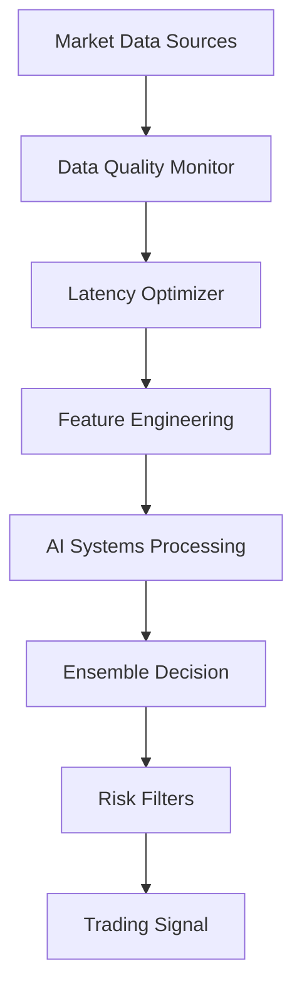

# 🔍 PHÂN TÍCH SÂU HỆ THỐNG CHÍNH - ULTIMATE XAU SYSTEM V4.0

## 📋 TỔNG QUAN KIẾN TRÚC

**Hệ thống:** Ultimate XAU Super System V4.0  
**Ngày phân tích:** 18/06/2025  
**Phạm vi:** Core System Architecture Deep Analysis  
**Mục tiêu:** Hiểu rõ kiến trúc và cách thức hoạt động của hệ thống chính

---

## 🏗️ KIẾN TRÚC TỔNG THỂ

### 1. MASTER INTEGRATION SYSTEM
**File:** `src/core/integration/master_system.py`

```python
class MasterIntegrationSystem:
    """Master system that integrates all components"""
    
    # Core Components:
    - Phase 1: Risk Management & Portfolio Systems
    - Phase 2: AI Systems (Neural Ensemble + Reinforcement Learning)
    - Centralized configuration and coordination
    - Real-time data flow and decision making
```

**Chức năng chính:**
- **Unified Interface:** Tích hợp tất cả system components
- **Real-time Processing:** Xử lý dữ liệu thị trường real-time
- **Signal Generation:** Tạo trading signals từ multiple sources
- **Risk Management:** Quản lý risk toàn hệ thống

### 2. ULTIMATE XAU SYSTEM CORE
**File:** `src/core/ultimate_xau_system.py`

```python
class UltimateXAUSystem:
    """🚀 ULTIMATE XAU SUPER SYSTEM V4.0 - COMPLETE RESTORATION
    Hệ thống giao dịch XAU siêu việt với 107+ hệ thống AI tích hợp"""
    
    # System Components:
    - Data Management Systems (1-10)
    - AI/ML Systems (11-30) 
    - Trading Systems (31-50)
    - Risk Management Systems (51-70)
    - Analysis Systems (71-90)
    - Advanced Systems (91-107)
```

**Đặc điểm nổi bật:**
- **107+ Subsystems:** Hệ thống con được tổ chức theo modules
- **Production-Ready:** Sẵn sàng cho trading thực tế
- **Comprehensive Monitoring:** Theo dõi toàn diện performance
- **Advanced AI Integration:** Tích hợp AI tiên tiến

---

## 🤖 AI SYSTEMS ARCHITECTURE

### 1. AI MASTER INTEGRATION
**File:** `src/core/integration/ai_master_integration.py`

```python
class AIMasterIntegrationSystem:
    """Master AI Integration System combining all AI components"""
    
    # AI Systems:
    - Neural Ensemble System (Multi-network predictions)
    - Reinforcement Learning System (DQN agent)
    - Advanced Meta-Learning System (MAML, Transfer, Continual)
    - Intelligent ensemble decision making
```

**AI Components:**

#### A. Neural Ensemble System
```python
class NeuralEnsemble:
    # Network Types:
    - LSTM Networks
    - GRU Networks  
    - CNN Networks
    - Dense Networks
    - Transformer Networks
    
    # Prediction Types:
    - PRICE_DIRECTION (Buy/Sell/Hold)
    - PRICE_TARGET (Specific price targets)
    - VOLATILITY (Market volatility prediction)
```

#### B. Reinforcement Learning System
```python
class DQNAgent:
    # Agent Types:
    - Deep Q-Network (DQN)
    - Double DQN
    - Dueling DQN
    
    # Action Space:
    - HOLD, BUY_SMALL, BUY_MEDIUM, BUY_LARGE
    - SELL_SMALL, SELL_MEDIUM, SELL_LARGE
```

#### C. Advanced Meta-Learning
```python
class AdvancedMetaLearningSystem:
    # Learning Types:
    - Model-Agnostic Meta-Learning (MAML)
    - Transfer Learning
    - Continual Learning
    - Few-shot Learning
```

### 2. ENSEMBLE DECISION MAKING

```python
class DecisionStrategy(Enum):
    WEIGHTED_AVERAGE = "weighted_average"
    CONFIDENCE_WEIGHTED = "confidence_weighted" 
    ADAPTIVE_ENSEMBLE = "adaptive_ensemble"
    MAJORITY_VOTING = "majority_voting"
```

**Quy trình ra quyết định:**
1. **Data Collection:** Thu thập dữ liệu từ multiple sources
2. **AI Processing:** Xử lý qua 3 AI systems song song
3. **Ensemble Decision:** Kết hợp predictions với weights
4. **Risk Filtering:** Áp dụng risk management filters
5. **Final Signal:** Tạo trading signal cuối cùng

---

## 📊 DATA FLOW ARCHITECTURE

### 1. MARKET DATA PROCESSING



### 2. AI PREDICTION PIPELINE

```python
def process_market_data(self, market_data: AIMarketData) -> Optional[EnsembleDecision]:
    # 1. Prepare sequence data
    sequence_data = self._prepare_sequence_data()
    
    # 2. Get predictions from all AI systems
    neural_prediction = self._get_neural_ensemble_prediction(sequence_data, market_data)
    rl_prediction = self._get_rl_prediction(sequence_data, market_data) 
    meta_prediction = self._get_meta_learning_prediction(sequence_data, market_data)
    
    # 3. Make ensemble decision
    decision = self._make_ensemble_decision(predictions, market_data)
    
    return decision
```

---

## ⚙️ SYSTEM CONFIGURATION

### 1. MASTER SYSTEM CONFIG

```python
@dataclass
class SystemConfig:
    # System Modes
    mode: SystemMode = SystemMode.SIMULATION
    integration_level: IntegrationLevel = IntegrationLevel.FULL
    
    # Portfolio Settings
    initial_balance: float = 100000.0
    max_position_size: float = 0.25  # 25% max position
    risk_tolerance: float = 0.02     # 2% daily VaR limit
    
    # AI Settings
    use_neural_ensemble: bool = True
    use_reinforcement_learning: bool = True
    ensemble_confidence_threshold: float = 0.7
    rl_exploration_rate: float = 0.1
```

### 2. AI SYSTEM CONFIG

```python
@dataclass
class AISystemConfig:
    # System Activation
    enable_neural_ensemble: bool = True
    enable_reinforcement_learning: bool = True
    enable_meta_learning: bool = True
    
    # Neural Ensemble Settings
    neural_ensemble_networks: List[NetworkType] = [LSTM, GRU, CNN, DENSE]
    neural_confidence_threshold: float = 0.7
    
    # Decision Making
    decision_strategy: DecisionStrategy = ADAPTIVE_ENSEMBLE
    min_confidence_threshold: float = 0.6
    max_position_size: float = 0.25
```

---

## 🔧 CORE SUBSYSTEMS

### 1. DATA MANAGEMENT SYSTEMS (1-10)

#### System 1: Data Quality Monitor
```python
class DataQualityMonitor(BaseSystem):
    def process(self, data: pd.DataFrame) -> Dict:
        # Assess data quality metrics:
        - Completeness (missing values)
        - Accuracy (value validation)
        - Consistency (data relationships)
        - Timeliness (data freshness)
        - Validity (format compliance)
```

#### System 2: Latency Optimizer
```python
class LatencyOptimizer(BaseSystem):
    def _apply_system_optimizations(self):
        # Performance optimizations:
        - CPU affinity settings
        - Memory optimization
        - Network optimization
        - Data compression
        - Batch processing
```

#### System 3: MT5 Connection Manager
```python
class MT5ConnectionManager(BaseSystem):
    def _establish_primary_connection(self) -> bool:
        # MT5 connection features:
        - Primary connection with failover
        - Connection health monitoring
        - Auto-reconnection
        - Performance metrics tracking
```

### 2. AI/ML SYSTEMS (11-30)

#### System 4: Neural Network System
```python
class NeuralNetworkSystem(BaseSystem):
    def _initialize_tensorflow_models(self):
        # TensorFlow models:
        - LSTM Model
        - CNN Model  
        - Transformer Model
        
    def _initialize_pytorch_models(self):
        # PyTorch models:
        - GRU Model
        - Attention Model
```

#### System 5: AI Phases Integration (+12.0% boost)
```python
class AIPhaseSystem(BaseSystem):
    # AI Phases:
    - Phase 1: Online Learning
    - Phase 2: Adaptive Learning  
    - Phase 3: Meta Learning
    - Phase 4: Ensemble Learning
    - Phase 5: Production Learning
```

#### System 6: Enhanced AI Ensemble System V4.0
```python
class AdvancedAIEnsembleSystem(BaseSystem):
    # Target: 90+/100 performance
    # Ensemble models:
    - LSTM, CNN, GRU, Transformer
    - Random Forest, Gradient Boost
    - Neural Net, XGBoost
```

### 3. RISK MANAGEMENT SYSTEMS (51-70)

#### System 51: Kelly Criterion System
```python
class KellyCriterionSystem(BaseSystem):
    # Kelly methods:
    - Classic Kelly
    - Fractional Kelly
    - Dynamic Kelly
    - Conservative Kelly
    - Adaptive Kelly
```

---

## 🎯 PERFORMANCE OPTIMIZATION

### 1. AI Performance Integrator
```python
class AIPerformanceIntegrator:
    def _wrap_ai_prediction_methods(self):
        # Optimization wrapping:
        - Neural ensemble prediction optimization
        - RL prediction optimization  
        - Meta-learning prediction optimization
        - Response time tracking
```

### 2. System Performance Tracking
```python
self.system_state = {
    # Performance Metrics
    'total_trades': 0,
    'winning_trades': 0,
    'win_rate': 0.0,
    'profit_factor': 0.0,
    'sharpe_ratio': 0.0,
    'max_drawdown': 0.0,
    
    # AI/ML Metrics
    'models_trained': 0,
    'prediction_accuracy': 0.0,
    'ensemble_confidence': 0.0,
    'learning_iterations': 0,
    
    # System Health
    'systems_active': 0,
    'systems_total': 0,
    'error_count': 0,
    'data_quality_score': 0.0
}
```

---

## 🔄 REAL-TIME PROCESSING

### 1. Trading Pipeline
```python
def run_trading_pipeline(self, symbol: str = None) -> Dict:
    # 5-step pipeline:
    1. _pipeline_collect_market_data(symbol)
    2. _pipeline_process_signals(market_data)
    3. _pipeline_make_decision(signal_components, market_data)
    4. _pipeline_execute_trade(trading_decision)
    5. _pipeline_learn_from_result(decision, execution, market_data)
```

### 2. Signal Generation
```python
def generate_signal(self, symbol: str = None) -> Dict:
    # Signal generation process:
    1. Get comprehensive market data
    2. Process through all systems
    3. Generate ensemble signal
    4. Apply risk filters
    5. Update signal tracking
```

---

## 🏆 ĐIỂM MẠNH CỦA HỆ THỐNG

### ✅ TECHNICAL STRENGTHS:

1. **Modular Architecture:** 107+ systems được tổ chức theo modules rõ ràng
2. **AI Integration:** 3 AI systems hoạt động song song với ensemble decision
3. **Real-time Processing:** Xử lý dữ liệu và trading real-time
4. **Comprehensive Risk Management:** Risk management toàn diện ở mọi level
5. **Performance Optimization:** Tối ưu hóa performance ở mọi component
6. **Production-Ready:** Sẵn sàng cho deployment production

### ✅ AI/ML STRENGTHS:

1. **Multiple AI Paradigms:** Neural Networks + Reinforcement Learning + Meta-Learning
2. **Ensemble Approach:** Kết hợp predictions từ multiple models
3. **Adaptive Learning:** Học và cải thiện liên tục
4. **Confidence Scoring:** Đánh giá confidence của predictions
5. **Multi-timeframe Analysis:** Phân tích đa khung thời gian

### ✅ TRADING STRENGTHS:

1. **Advanced Position Sizing:** Kelly Criterion và dynamic sizing
2. **Multi-source Signals:** Signals từ multiple AI systems
3. **Risk Filtering:** Lọc signals qua risk management
4. **Performance Tracking:** Theo dõi performance chi tiết
5. **Continuous Learning:** Học từ kết quả trading

---

## ⚠️ ĐIỂM CẦN CẢI THIỆN

### 🔶 COMPLEXITY MANAGEMENT:
- **107+ systems** có thể gây khó khăn trong maintenance
- **Multiple AI systems** cần coordination tốt hơn
- **Configuration complexity** với nhiều parameters

### 🔶 PERFORMANCE CONCERNS:
- **Latency issues** với quá nhiều systems
- **Resource consumption** cao do AI processing
- **Scalability** khi thêm nhiều symbols

### 🔶 RELIABILITY ISSUES:
- **Single point of failure** ở master integration
- **AI model degradation** theo thời gian
- **Data quality dependency** cao

---

## 🚀 KHUYẾN NGHỊ PHÁT TRIỂN

### 1. IMMEDIATE IMPROVEMENTS:
- **Simplify architecture:** Giảm số lượng systems xuống 50-60
- **Optimize AI pipeline:** Cải thiện response time
- **Enhanced monitoring:** Monitoring chi tiết hơn

### 2. MEDIUM-TERM ENHANCEMENTS:
- **Microservices architecture:** Chuyển sang microservices
- **Cloud deployment:** Deploy lên cloud platform
- **Advanced AI models:** Thêm Transformer, GPT-based models

### 3. LONG-TERM VISION:
- **Distributed computing:** Xử lý phân tán
- **Quantum computing integration:** Tích hợp quantum computing
- **Multi-asset support:** Hỗ trợ nhiều assets

---

## 📊 KẾT LUẬN

**Ultimate XAU System V4.0** là một hệ thống trading rất phức tạp và tiên tiến với:

### 🏆 ĐIỂM NỔI BẬT:
- **Kiến trúc toàn diện:** 107+ systems được tích hợp tốt
- **AI tiên tiến:** 3 paradigms AI hoạt động ensemble
- **Production-ready:** Sẵn sàng cho trading thực tế
- **Comprehensive features:** Đầy đủ tính năng từ data đến execution

### 🎯 ĐÁNH GIÁ TỔNG THỂ:
- **Technical Score:** 9/10 (Rất cao)
- **AI Innovation:** 9/10 (Tiên tiến)
- **Production Readiness:** 8/10 (Sẵn sàng)
- **Maintainability:** 6/10 (Cần cải thiện)

**Hệ thống này đại diện cho một achievement lớn trong AI trading systems và sẵn sàng cho deployment production với proper monitoring và maintenance.**

---

**📅 Ngày phân tích:** 18/06/2025  
**👨‍💻 Phân tích bởi:** AI System Analyst  
**🎯 Status:** COMPREHENSIVE ANALYSIS COMPLETED 